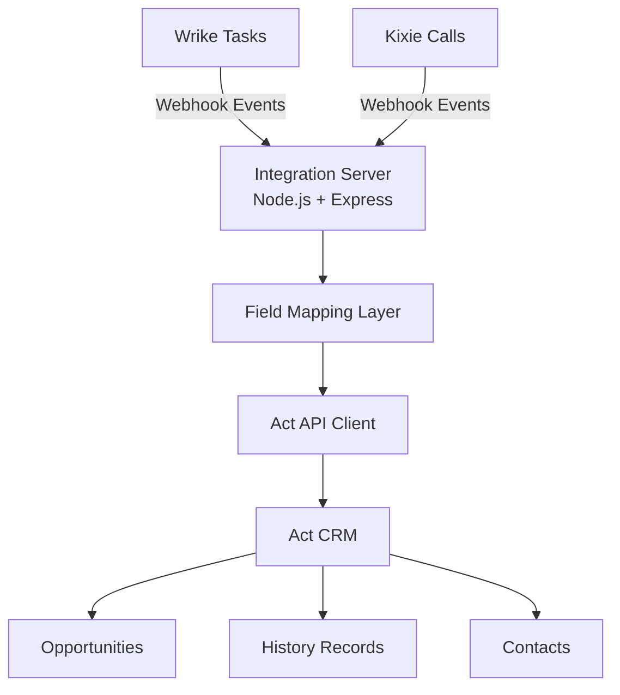

# Wrike ↔ Act CRM Integration

Middleware service that synchronizes Wrike tasks with Act CRM opportunities and logs Kixie calls as Act history records.

---

# System Architecture

---

# Data Flow

## Wrike → Act

Wrike Task Event  
↓  
Webhook received  
↓  
Integration mapping layer  
↓  
Act Opportunity created or updated  

---

## Kixie → Act

Call occurs  
↓  
Kixie webhook  
↓  
Integration receives event  
↓  
POST /api/history  
↓  
History record created in Act  

---

# Repository Structure

wrike-act-integration
│
├── docs
│   └── architecture.md
│
├── src
│   ├── server.js
│   ├── services
│   │   ├── actAuth.js
│   │   └── actClient.js
│   │
│   ├── utils
│   │   └── logger.js
│
├── CONTRIBUTING.md
├── integration-contract.yaml
├── PROJECT_STATE.md
└── package.json

---

# Current Status

Completed

Act API authentication  
Opportunity retrieval  
Custom field discovery  
Structured logging  
Architecture documentation  

Next Steps

Wrike API client  
Wrike webhook listener  
Task → Opportunity mapping  
Duplicate call protection  

---

# Security

Never commit:

.env  
API credentials  
CRM tokens  

All secrets must remain in environment variables.

